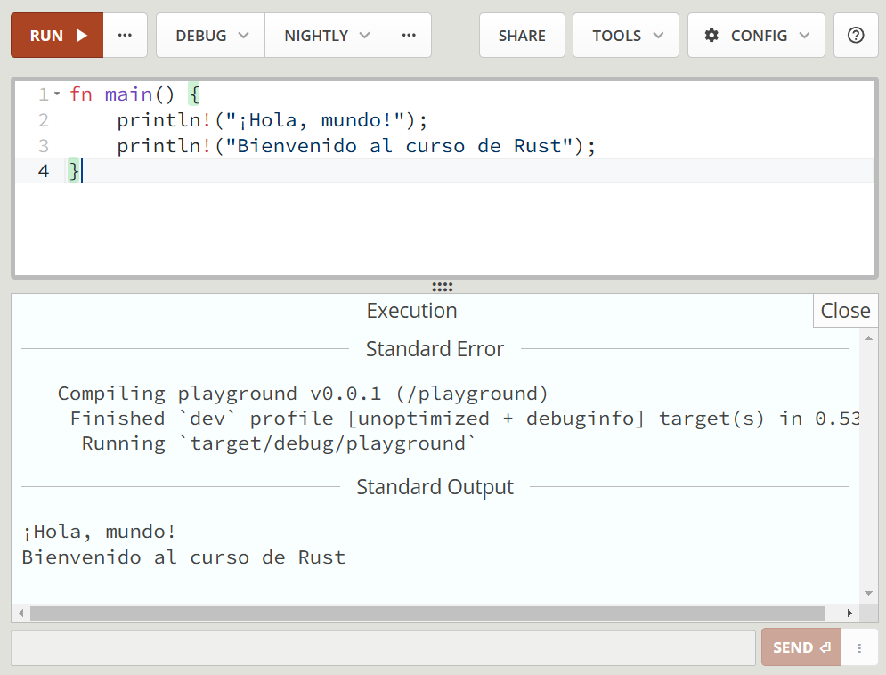

El **Playground de Rust** es una herramienta en línea proporcionada por la comunidad de Rust que permite escribir, compilar y ejecutar código Rust directamente desde un navegador, sin necesidad de instalar nada localmente. Es una plataforma perfecta para experimentar con el lenguaje, probar pequeñas piezas de código y compartir ejemplos con otros desarrolladores.

## ¿Para qué se puede usar?

El Playground de Rust es útil para una variedad de casos, tales como:

- **Aprender Rust**: Los principiantes pueden practicar el lenguaje sin preocuparse por la instalación o configuración.
- **Probar fragmentos de código**: Los desarrolladores pueden probar rápidamente ideas o fragmentos de código sin necesidad de configurar un proyecto completo.
- **Compartir código**: El Playground genera enlaces compartibles, lo que facilita la colaboración o pedir ayuda en foros y comunidades de Rust.


:::note 
**Nota:** El Playground de Rust es ideal para ejemplos pequeños o pruebas rápidas, pero no está diseñado para proyectos de gran envergadura o código muy complejo.
:::

## Herramientas y características

El Playground de Rust no solo permite la ejecución básica de código, sino que ofrece un conjunto de herramientas adicionales que lo hacen bastante completo:

- **Edición de código**: Un editor de texto con resaltado de sintaxis y autocompletado para facilitar la escritura de código.
- **Soporte para múltiples ediciones de Rust**: Puedes seleccionar entre las versiones estables, beta y nightly del compilador de Rust.
- **Compatibilidad con crates**: El Playground te permite usar algunas crates (paquetes) populares para que puedas experimentar con ellas sin necesidad de instalar dependencias localmente.
- **Formatteo y linting**: Herramientas como `rustfmt` (formateador de código) y `clippy` (analizador de código) están integradas para ayudarte a escribir código limpio y seguir las mejores prácticas.
- **Soporte para Macros y Cargo**: Puedes probar macros de Rust y realizar pequeñas compilaciones con `Cargo`, el gestor de paquetes de Rust.

## Opciones de compilación

El Playground también permite personalizar las opciones de compilación para ajustar el comportamiento del compilador y experimentar con optimizaciones:

- **Desactivar optimizaciones**: Esto permite compilar y ejecutar el código rápidamente, sin optimizaciones adicionales. Ideal para pruebas rápidas.
- **Optimizaciones para velocidad o tamaño**: Puedes ajustar el compilador para que optimice tu código en función del rendimiento o el tamaño del binario generado.
- **Modo de depuración**: Permite obtener información detallada sobre errores y advertencias, ideal para entender el comportamiento del código o depurar problemas.

## Ejemplo de uso 

Aquí tienes un ejemplo paso a paso de cómo usar el **Playground de Rust**, desde acceder a la página hasta escribir y ejecutar un código básico, explicando cada línea del código.

import { Steps } from '@astrojs/starlight/components';

<Steps>

1. **Acceder al Playground**: Visita la página del Playground de Rust en [https://play.rust-lang.org](https://play.rust-lang.org), donde podrás escribir y ejecutar código Rust en línea.

2. **Escribir el código**: Escribe el código de ejemplo en el editor del Playground. En este caso, usaremos un programa simple que imprime dos mensajes en la consola.

    Para modificar el código, puedes hacer clic en el editor y realizar los cambios necesarios. Por ejemplo, puedes cambiar el mensajes para que muestre en otro idioma o agregar más líneas de código.

    ```rust
    fn main() {
        println!("¡Hola, mundo!");
        println!("Bienvenido al curso de Rust");
    }
    ```

3. **Ejecutar el código**: Haz clic en el botón **"Run"** en la parte superior del editor para compilar y ejecutar el código. Verás la salida del programa debajo del editor o en la parte derecha del editor.

    ```bash
    Compiling playground v0.0.1 (/playground)
        Finished `dev` profile [unoptimized + debuginfo] target(s) in 0.53s
        Running `target/debug/playground`
    Standard Output
    ¡Hola, mundo!
    Bienvenido al curso de Rust
    ```

4. **Compartir el código**: Si deseas compartir tu código con otros, puedes hacer clic en **"Share"** para obtener un enlace que llevará a las personas al Playground con tu código pre-cargado.

5. **Más opciones**: En la parte superior del editor, encontrarás opciones para personalizar la compilación, como desactivar optimizaciones, ajustar el nivel de optimización y habilitar el modo de depuración.

    

</Steps>


## Explicación del código 

```rust
fn main() {
```
- **`fn`** es la palabra clave que indica que estás definiendo una función. En Rust, todas las aplicaciones comienzan en la función especial llamada `main`.
  
```rust
    println!("¡Hola, mundo!");
```
- **`println!`** es una macro que imprime texto en la consola. El texto que va entre comillas dobles, `"¡Hola, mundo!"`, es lo que se mostrará al ejecutarse el programa. La macro termina con un punto y coma `;`.

```rust
    println!("Bienvenido al curso de Rust");
```
- De nuevo, estamos usando la macro `println!`, pero esta vez para imprimir `"Bienvenido al curso de Rust"`. Puedes usar tantas llamadas a `println!` como necesites para mostrar diferentes mensajes en la consola.

Este proceso te permite probar Rust de forma interactiva, sin necesidad de instalar nada en tu computadora, perfecto para aprender y compartir ejemplos con otros.
