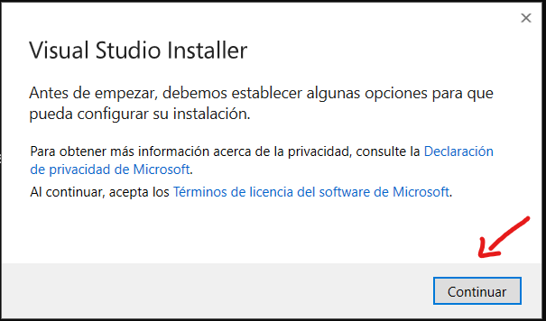
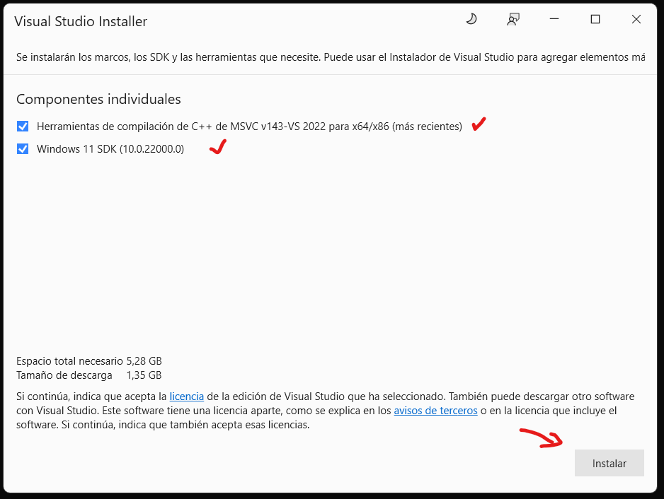
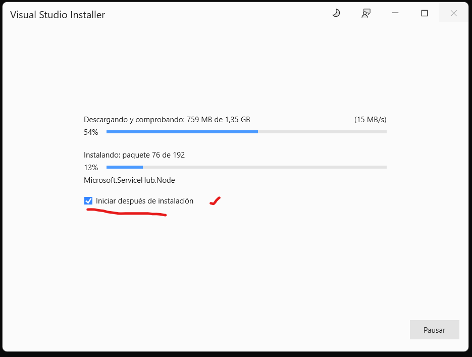
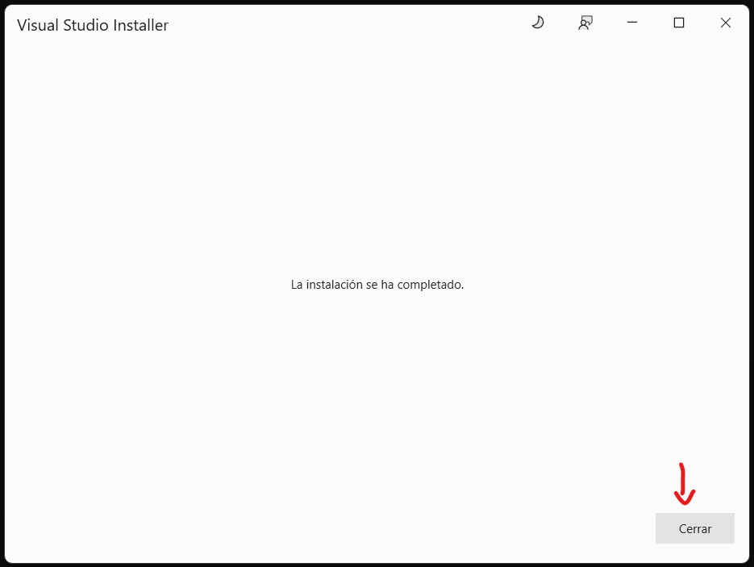
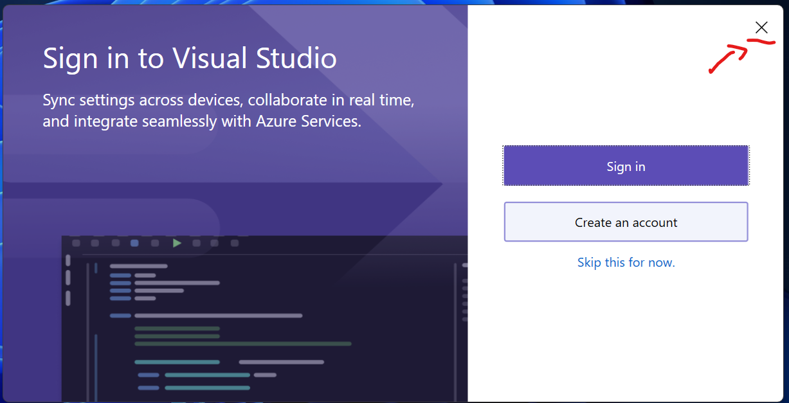

## Guía de Instalación de Rust en Windows

Rust es un lenguaje de programación que ofrece alto rendimiento y seguridad en la memoria. Este artículo te guiará a través del proceso de instalación de Rust en Windows, explicando cada uno de los pasos necesarios, así como las opciones disponibles durante la instalación.

### Accede al Instalador de Rust

1. **Accede a la Página de Instalación de Rust:**
   Dirígete a la [página de instalación de Rust](https://www.rust-lang.org/es/tools/install).

2. **Descarga el Instalador:**
   En la página, encontrarás un enlace para descargar el instalador de Rust para Windows. Haz clic en el enlace para descargar el archivo `.exe`.

### Ejecuta el Instalador de Rust

1. **Ejecuta el Archivo Descargado:**
   Una vez que hayas descargado el archivo, haz doble clic en él para iniciar la instalación.

2. **Requisitos Previos de Visual C++:**
   Rust requiere un compilador y bibliotecas de la API de Windows que no parecen estar disponibles en tu sistema. Puedes instalar estos componentes a través del instalador de Visual Studio. Se te presentarán las siguientes opciones:

   ```shell
    Rust Visual C++ prerequisites

    Rust requires a linker and Windows API libraries but they don't seem to be
    available.

    These components can be acquired through a Visual Studio installer.

    1) Quick install via the Visual Studio Community installer
    (free for individuals, academic uses, and open source).

    2) Manually install the prerequisites
    (for enterprise and advanced users).

    3) Don't install the prerequisites (if you're targeting the GNU ABI).

    > 
   ```

   - **Instalación Rápida a través del Instalador de Visual Studio Community (recomendado para individuos, usos académicos y código abierto):**
     Esta opción es la más sencilla. El instalador de Visual Studio Community es gratuito para estos usos y te permitirá instalar las herramientas necesarias rápidamente.

   - **Instalación Manual de los Requisitos Previos (para usuarios avanzados y empresariales):**
     Si prefieres un control más detallado sobre la instalación, puedes instalar manualmente los requisitos necesarios.

   - **No Instalar los Requisitos Previos (si estás apuntando al ABI de GNU):**
     Puedes optar por no instalar los requisitos previos si planeas utilizar Rust con el ABI de GNU, aunque esto puede limitar algunas características.

   Para la mayoría de los usuarios, la **opción 1** es la más recomendada.

##### Instalación de Visual Studio Community

1. **Instala Visual Studio Community:**
   Si optas por la instalación rápida, se te redirigirá a Visual Studio Community. Aquí tienes un paso a paso:

   - **Paso 1: Inicia el Instalador de Visual Studio Community:**
     
     Presiona el botón "Continuar" para comenzar.

   - **Paso 2: Selecciona los Componentes Necesarios:**
     
     Marca las siguientes opciones en "Componentes individuales":
     - Herramientas de compilación de C++ de MSVC
     - Windows 11 SDK
     Luego, presiona el botón "Instalar".

   - **Paso 3: Espera a que la Instalación Finalice:**
     
     La instalación puede tardar unos minutos. Espera a que termine.

   - **Paso 4: Finaliza la Instalación:**
     Una vez completada la instalación, verás las ventanas de:
     
     
     Asegúrate de cerrar estas ventanas.

##### Continuación de la Instalación de Rust

1. **Regresa a la Consola de Rust:**
   Después de instalar los requisitos previos, vuelve a la consola donde estabas instalando Rust.

2. **Opciones de Instalación:**
   Se te presentarán las siguientes opciones:
   ```shell
    Current installation options:

    default host triple: x86_64-pc-windows-msvc
     default toolchain: stable (default)
               profile: default
    modify PATH variable: yes

    1) Proceed with standard installation (default - just press enter)
    2) Customize installation
    3) Cancel installation
    >
   ```

   - **Opción 1: Proceder con la Instalación Estándar (Predeterminada)**
     Esta opción es la más sencilla y es adecuada para la mayoría de los usuarios. Solo presiona Enter para continuar con la configuración predeterminada.

   - **Opción 2: Personalizar la Instalación**
     Si deseas ajustar configuraciones específicas de la instalación, selecciona esta opción.

   - **Opción 3: Cancelar Instalación**
     Si decides no proceder, selecciona esta opción para cancelar el proceso.

   Para la mayoría de los usuarios, la **opción 1** es la recomendada.

3. **Finaliza la Instalación:**
   Una vez que el proceso haya terminado, verás el mensaje:
   ```bash
   stable-x86_64-pc-windows-msvc installed - rustc 1.81.0 (eeb90cda1 2024-09-04)

   Rust is installed now. Great!

   To get started you may need to restart your current shell.
   This would reload its PATH environment variable to include Cargo's bin directory (%USERPROFILE%\.cargo\bin).

   Press the Enter key to continue.
   ```

   Esto indica que Rust se ha instalado correctamente. Para completar la configuración, puede ser necesario reiniciar tu terminal para que se actualice la variable de entorno PATH.

4. **Verifica la Instalación de Rust:**
   Para confirmar que Rust se ha instalado correctamente, abre una nueva consola y ejecuta el siguiente comando:

   ```shell
    alexroel: ~ ❯ rustc --version
    rustc 1.81.0 (eeb90cda1 2024-09-04)
   ```

   Ahora estás listo para comenzar a programar en Rust. ¡Feliz codificación!

    :::tip[Otros Sistemas Operativos]
    Subsistema de Windows para Linux (WSL): Si estás utilizando WSL, sigue las instrucciones específicas para instalar Rust en un entorno Linux.

    Linux: Para usuarios de Linux, sigue la guía de instalación de Rust para Linux específica para tu distribución.

    ```bash
    curl --proto '=https' --tlsv1.2 -sSf https://sh.rustup.rs | sh
    ```
    Mac: En macOS,tambien puedes seguir los pasos de la página oficial:

    ```bash
    curl --proto '=https' --tlsv1.2 -sSf https://sh.rustup.rs | sh
    ```

    El proceso es lo mismo: 

    ```bash
    1) Proceed with standard installation (default)
    2) Customize installation
    3) Cancel installation
    >
    ```
    :::

