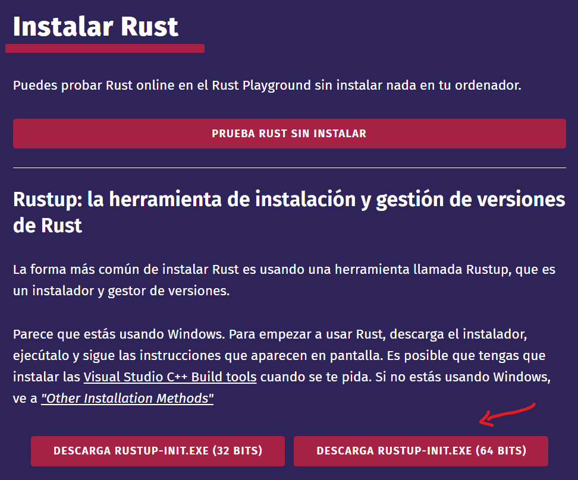
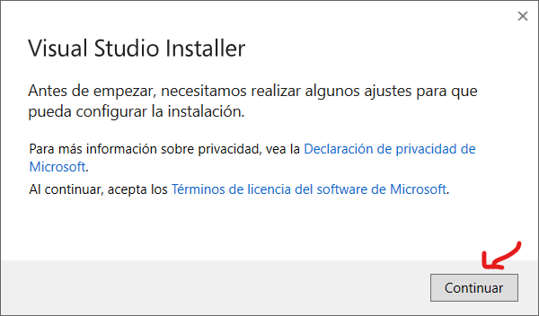
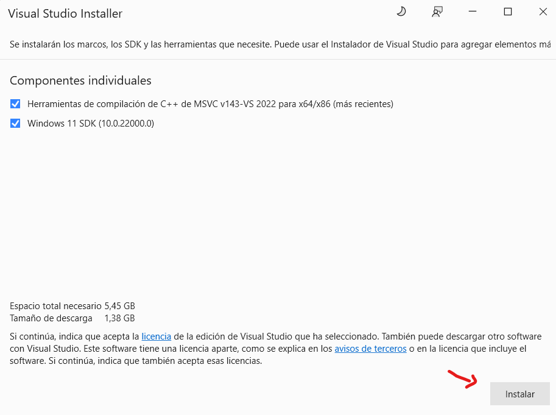
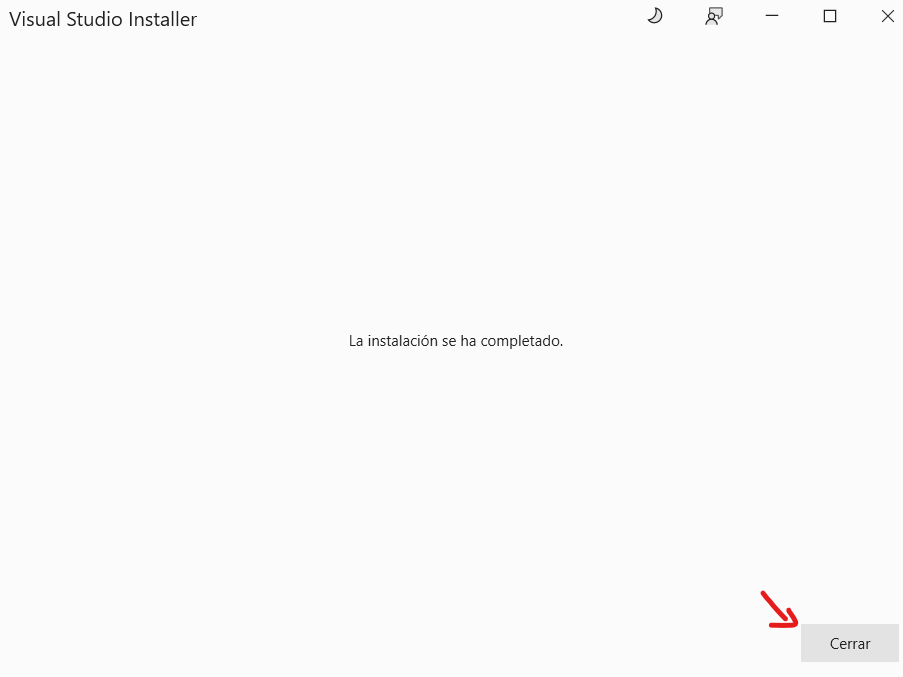
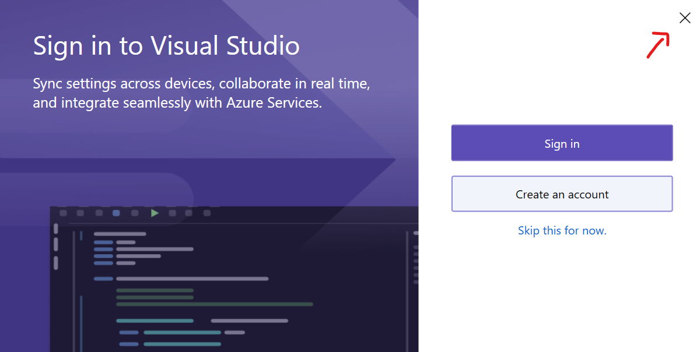

En está guia aprenderás a instalar Rust en tu sistema operativo. Rust es un lenguaje de programación de sistemas que se enfoca en la seguridad, la velocidad y la concurrencia. Es una excelente opción para desarrollar aplicaciones de alto rendimiento y sistemas embebidos.

Para instalar Rust en tu sistema, sigue los pasos a continuación. Dependiendo de tu sistema operativo, los pasos pueden variar ligeramente.

import { Tabs, TabItem, Steps } from '@astrojs/starlight/components';

<Tabs>
  <TabItem label="Windows" icon='seti:windows'>
    

    <Steps>

    1. **Accede a la** [Página de Instalación de Rust](https://www.rust-lang.org/es/learn/get-started)
    
        Descargar el instalador de Rust para Windows. 
      

    2. **Ejecuta el archivo descargado**: Una vez que hayas descargado el instalador, ejecuta el archivo para comenzar con la instalación.

    3. **Requisitos Previos de Visual C++:** Rust requiere un compilador y bibliotecas de la API de Windows que no parecen estar disponibles en tu sistema. Puedes instalar estos componentes a través del instalador de Visual Studio. Se te presentarán las siguientes opciones:
        ```shell
          Rust Visual C++ prerequisites

          Rust requires a linker and Windows API libraries but they don't seem to be
          available.

          These components can be acquired through a Visual Studio installer.

          1) Quick install via the Visual Studio Community installer
          (free for individuals, academic uses, and open source).

          2) Manually install the prerequisites
          (for enterprise and advanced users).

          3) Don't install the prerequisites (if you're targeting the GNU ABI).

          > 
        ```

        - **Instalación Rápida a través del Instalador de Visual Studio Community (recomendado para individuos, usos académicos y código abierto):** Esta opción es la más sencilla. El instalador de Visual Studio Community es gratuito para estos usos y te permitirá instalar las herramientas necesarias rápidamente.

        - **Instalación Manual de los Requisitos Previos (para usuarios avanzados y empresariales):** Si prefieres un control más detallado sobre la instalación, puedes instalar manualmente los requisitos necesarios.

        - **No Instalar los Requisitos Previos (si estás apuntando al ABI de GNU):** Puedes optar por no instalar los requisitos previos si planeas utilizar Rust con el ABI de GNU, aunque esto puede limitar algunas características.

        Para la mayoría de los usuarios, la **opción 1** es la más recomendada.
    
    4. **Instalación de Visual Studio Community**: Si optas por la instalación rápida, se te redirigirá a Visual Studio Community. Aquí tienes un paso a paso:

        1. Inicia el Instalador de Visual Studio Community:**
          
          Presiona el botón "Continuar" para comenzar.

        2. **Selecciona los Componentes Necesarios:**
          
          Marca las siguientes opciones en "Componentes individuales":
            - Herramientas de compilación de C++ de MSVC
            - Windows 11 SDK
          Luego, presiona el botón "Instalar".

        3. **Espera a que la Instalación Finalice:**
          La instalación puede tardar unos minutos. Espera a que termine.

        4. **Finaliza la Instalación:**
          Una vez completada la instalación, verás las ventanas de:
          
          
          Asegúrate de cerrar estas ventanas.

    5. **Continuación de la Instalación de Rust**: Después de instalar los requisitos previos, regresa a la consola de Rust para continuar con la instalación. Se te presentarán las siguientes opciones:
        ```shell
          Current installation options:

          default host triple: x86_64-pc-windows-msvc
          default toolchain: stable (default)
          profile: default
          modify PATH variable: yes

          1) Proceed with standard installation (default - just press enter)
          2) Customize installation
          3) Cancel installation
          >
        ```

        - **Opción 1: Proceder con la Instalación Estándar (Predeterminada):** Esta opción es la más sencilla y es adecuada para la mayoría de los usuarios. Solo presiona Enter para continuar con la configuración predeterminada.

        - **Opción 2: Personalizar la Instalación:** Si deseas ajustar configuraciones específicas de la instalación, selecciona esta opción.

        - **Opción 3: Cancelar la Instalación:** Si decides no proceder, selecciona esta opción para cancelar el proceso.

        Para la mayoría de los usuarios, la **opción 1** es la recomendada.

    6. **Finaliza la Instalación:** Una vez que el proceso haya terminado, verás el mensaje:
        ```shell
          stable-x86_64-pc-windows-msvc installed - rustc 1.81.0 (eeb90cda1 2024-09-04)

          Rust is installed now. Great!

          To get started you may need to restart your current shell.
          This would reload its PATH environment variable to include Cargo's bin directory (%USERPROFILE%\.cargo\bin).

          Press the Enter key to continue.
        ```
    
    7. **Verifica la Instalación de Rust:** Para confirmar que Rust se ha instalado correctamente, abre una nueva consola y ejecuta el siguiente comando:
        ```shell
          alexroel: ~ ❯ rustc --version
          rustc 1.84.1 (e71f9a9a9 2025-01-27)
        ```
        Ahora estás listo para comenzar a programar en Rust. ¡Feliz codificación!
    
    </Steps>
  </TabItem>
  <TabItem label="Linux" icon='linux'>
    <Steps>
      1. **Accede a la** [Página de Instalación de Rust](https://www.rust-lang.org/es/learn/get-started)

      2. **Ejecuta el comando de instalación de Rust:**
          ```bash
            curl --proto '=https' --tlsv1.2 -sSf https://sh.rustup.rs | sh
          ```
          Este comando descargará e instalará Rust en tu sistema.

      3. **Configura Rust:** Durante la instalación, se te presentarán las siguientes opciones:
          ```bash
            ...
            
            Current installation options:

            default host triple: x86_64-unknown-linux-gnu
            default toolchain: stable (default)
            profile: default
            modify PATH variable: yes

            1) Proceed with installation (default - just press enter)
            2) Customize installation
            3) Cancel installation
            >
          ```

          - **Opción 1: Proceder con la Instalación (Predeterminada):** Esta opción es la más sencilla y es adecuada para la mayoría de los usuarios. Solo presiona Enter para continuar con la configuración predeterminada.

          - **Opción 2: Personalizar la Instalación:** Si deseas ajustar configuraciones específicas de la instalación, selecciona esta opción.

          - **Opción 3: Cancelar la Instalación:** Si decides no proceder, selecciona esta opción para cancelar el proceso.

          Para la mayoría de los usuarios, la **opción 1** es la recomendada.

      4. **Verifica la Instalación de Rust:** Para confirmar que Rust se ha instalado correctamente, abre una nueva terminal y ejecuta el siguiente comando:
          ```bash
            alexroel @ HP in ~ $ rustc --version
            rustc 1.84.1 (e71f9a9a9 2025-01-27)
          ```
          Ahora estás listo para comenzar a programar en Rust. ¡Feliz codificación!
  </Steps>
  </TabItem>
  <TabItem label="Mac" icon='apple'>
    <Steps>
      1. **Accede a la** [Página de Instalación de Rust](https://www.rust-lang.org/es/learn/get-started)

      2. **Ejecuta el comando de instalación de Rust:**
          ```bash
            curl --proto '=https' --tlsv1.2 -sSf https://sh.rustup.rs | sh
          ```
          Este comando descargará e instalará Rust en tu sistema.

      3. **Configura Rust:** Durante la instalación, se te presentarán las siguientes opciones:
          ```bash
            ...
            
            Current installation options:

            default host triple: x86_64-unknown-linux-gnu
            default toolchain: stable (default)
            profile: default
            modify PATH variable: yes

            1) Proceed with installation (default - just press enter)
            2) Customize installation
            3) Cancel installation
            >
          ```

          - **Opción 1: Proceder con la Instalación (Predeterminada):** Esta opción es la más sencilla y es adecuada para la mayoría de los usuarios. Solo presiona Enter para continuar con la configuración predeterminada.

          - **Opción 2: Personalizar la Instalación:** Si deseas ajustar configuraciones específicas de la instalación, selecciona esta opción.

          - **Opción 3: Cancelar la Instalación:** Si decides no proceder, selecciona esta opción para cancelar el proceso.

          Para la mayoría de los usuarios, la **opción 1** es la recomendada.

      4. **Verifica la Instalación de Rust:** Para confirmar que Rust se ha instalado correctamente, abre una nueva terminal y ejecuta el siguiente comando:
          ```bash
            rustc --version
            rustc 1.84.1 (e71f9a9a9 2025-01-27)
          ```
          Ahora estás listo para comenzar a programar en Rust. ¡Feliz codificación!
    </Steps>
  </TabItem>
</Tabs>

Ahora que has instalado Rust en tu sistema, estás listo para comenzar a programar en este poderoso lenguaje de programación.


